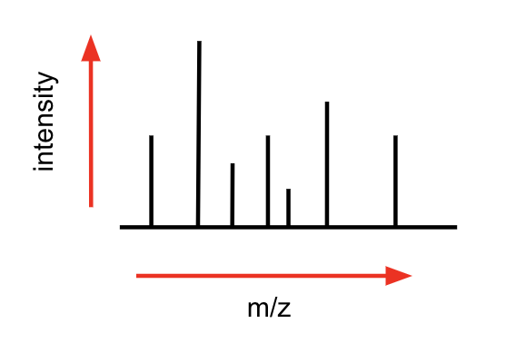

Background
==========

What are proteins and peptides?
^^^^^^^^^^^^^^^^^^^^^^^^^^^^^^^

Proteins are long chains of amino acids (AAs) that do many different things in 
the body. Peptides are subsets of these sequences. A hybrid peptide is one 
where each of the two halves are not translated from RNA to the protein as that 
subsequence. There are two classes of hybrid peptides: (1) cis-spliced and (2) 
trans-spliced. Cis-spliced hybrids are hybrid peptides where each half of the 
peptide comes from the same source proteins, but from different places on the 
protein. For example, if the hybrid peptide is *ABCD-EFGH*, then maybe the left 
half *ABCD* comes from the protein at position 102 and the right half *EFGH* 
comes from the protein at position 2. Trans-spliced peptides are where each 
half of the peptide comes from different source proteins altogether. The two 
halves of a peptide are referred to as the "N terminus", left half, and 
the "C terminus". 

What is mass spec?
^^^^^^^^^^^^^^^^^^

Mass spec, or mass spectrometry (MS), is the process of taking some molecule and 
breaking it into pieces. The resulting *spectrum* of *masses* are the 
mass-to-charge (m/z) ratios of the fragments, or fragment ions. "Masses" in MS 
are measured in Daltons (Da), which are approximately one atomic mass unit (amu)
. It is slightly different than an amu, but just slightly. A charge is the 
ionization of the molecule, and typically takes on values of 1 or 2.  Every m/z 
entry is somewhat ambiguous as it is both the mass and the charge of a single 
fragment ion. For example, the same fragment might break off twice and have an 
isotopic mass (not charged) of 100. If the first time it was fragmented it had a 
charge of 1, the final m/z value would be 100. However, if the second time the 
fragment ion had a charge of 2, the m/z value would be 50. This ambiguity makes
the alignment process a little bit more difficult. If you want to know more 
about the specific processes (and I would recommend doing so at some point), 
check out the wikipedia_ page as well as looking through your own findings from 
Google. 

.. _wikipedia: https://en.wikipedia.org/wiki/Mass_spectrometry

Most discussions about MS in the protein world focuses on tandem MS, or MS/MS, 
or MS \ :sup:`2`\. This simply means that the fragmentation process occurs twice: 
once to isolate a peptide, and a second to framgent the peptide into its AA 
subparts. The first round of MS will give us what is call a "precursor mass" as 
well as a "precursor charge". These precursor values are the mass and charge of 
the peptide as a whole. This overall mass is useful in comparing an alignment to 
the observed as we can see if the overall mass is the same. 

What does mass spec data look like?
^^^^^^^^^^^^^^^^^^^^^^^^^^^^^^^^^^^

MS data has three primary components: 

1. a list of *m/z* values 
2. a list of intensity (abundance) values 
3. precursor information

m/z values 
""""""""""

As discussed above, *m/z* values are mass to charge ratios. Each mass has an 
associated charge, and the mass is divided by the charge to get the m/z value. 
A charge of 1 is referred to as a "singly charged ion", and a charge of 2 is a 
"doubly charged ion". 

Most discussions of ions in proteomics is about "b" and "y" ions. b ions are 
the ions to the right of a peptide fragment from the N terminus y ions are to
the left of a peptide fragment from the C terminus. The figure below should help
clear this up. 

.. image:: images/b-y_ions.png
   :width: 600

Combining the ideas of b and y ions with singly and doubly charged ions, we get 
four different ions that could describe the same junction: singly b, doubly b, 
singly y, doubly y. We will abbreviate theses as b+, b++, y+, y++. When we say 
that they describe the same junction, we don't mean the same series of AAs. 
As shown above, the b ions only describe left-to-right, and y right-to-left. 
Junction means the same breaking point. For the above example, you can see that 
the ions b \ :sub:`4`\   and y \ :sub:`2`\   both describe the same junction.
The following image shows all singly and doubly b and y ions for the same 
sequence. 

.. image:: images/singly_doubly_b_y.png
   :width: 600

If we were to get this sequence as an observed spectrum (from and MS/MS run), 
you would not get all of these ions. In fact, its unlikely you would get ions 
that cover all junctions. You may get six ions, but they may only cover four 
of the junction sites. However, six is enough to get a strong score. 
Additionally, the masses would not be exact, but slighly off. Maybe a few 
.001 Daltons off either above or below. You would also see quite a bit of noise. 
After some filtering, you may end up with 20 *peaks* (m/z values), but only six 
of them are what you want and the other 14 are noise. They would be sorted by 
value with no position information encoded. What you would see is a list of 20 
floating point numbers with no ordering and six m/z values in there from the 
above image but with some error. 

intensity values 
""""""""""""""""

Intensity (or abundance) values tell us *how much* of an m/z value was found in 
the sample. Most of the tools and literature in the proteomics world use the 
abundances for filtering and sometimes for indicating confidence in alignments
with very few actually incorporating it into their scoring algorithms. Below 
is how MS data is typically plotted. The x-axis is m/z, and y the intensity.

Intensity values have an incredible range. Each spectrum is different. Sometimes 
there will be one dominant peak, other times there will be a few large peaks. 
Intensity values are used to filter out noise primarily. They are parallel lists
of floats to the m/z values, with index *i* of the abundances corresponding to 
the *i* \ :sup:`th`\   m/z value. Often the top 20 to 30 most abundant peaks 
(m/z values with the abundance values in the top 20) are kept. 

precursor information
"""""""""""""""""""""

As stated earlier, precursor information entails both mass and charge. These 
values come from the first MS run in MS/MS. It tells us the mass of the entire 
observed peptide as well as the charge of it. This information is used in 
alignments in order to confirm or deny a sequence as a candidate peptide 
sequence. If we find 10 ions that match this peptide sequence, but the precursor
mass is off by a few Daltons, we know this is wrong. Modern mass 
spectrometers are accurate enough to allow us to only accept tolerances at about 
10 parts per million (ppm). For a precursor mass of 800, this would be a 
tolerance of .008 Daltons. Therefore, any peptide sequence we assign as an 
alignment to this spectrum must have a calculated precursor mass in the range 
of 799.992 and 800.008. With AA masses (isotopic mass) in the range of 50 to 150
, this is extreme accuracy. 

How do we create an alignment?
^^^^^^^^^^^^^^^^^^^^^^^^^^^^^^

There are two paradigms when it comes to making protein alignments on MS data: 
*de novo* sequencing and database search. *De novo* sequencing is the process 
of assigning AA tags to masses in a dynamic programming way. Think about the 
knapsack problem where the size of the knapsack is the precursor mass and the 
elements are the observed masses. When we can fill the knapsack, we can assign 
AA tags to each element in the knapsack, creating an alignment. The problem 
with *de novo* sequencing however is that is fairly inaccurate and reports 
high numbers of novel peptide sequences. The reason we choose to not use 
*de novo* sequencing is while we want to identify novel sequences, 
we want high confidence that a hybrid alignment is in fact a hybrid alignment, 
so we rely on database entries. For this reason, we choose database search. 

Database searches are fairly straightforward. At a very high level, a database 
search takes an input spectrum, looks through all of the protein entries, 
looks through all of the subsequences of the protein, creates a theoretical 
spectrum and scores the observed against the theoretical. A match is then 
the highest scoring peptide found in the database with a theoretical precursor
that falls within the allowed tolerance. 

While scoring algorithms are a dime a dozen, most use the same core idea: how 
many ions can we match in the observed to a theoretical spectrum. If we have a 
peptide *ABCDE* with masses *[100, 150, 275, 410, 475]* and the observed is 
*[100, 275, 300, 400, 475, 500]*, we would give this peptide a score of 3. 
Doing this across all possible peptides gives us an alignment. 

